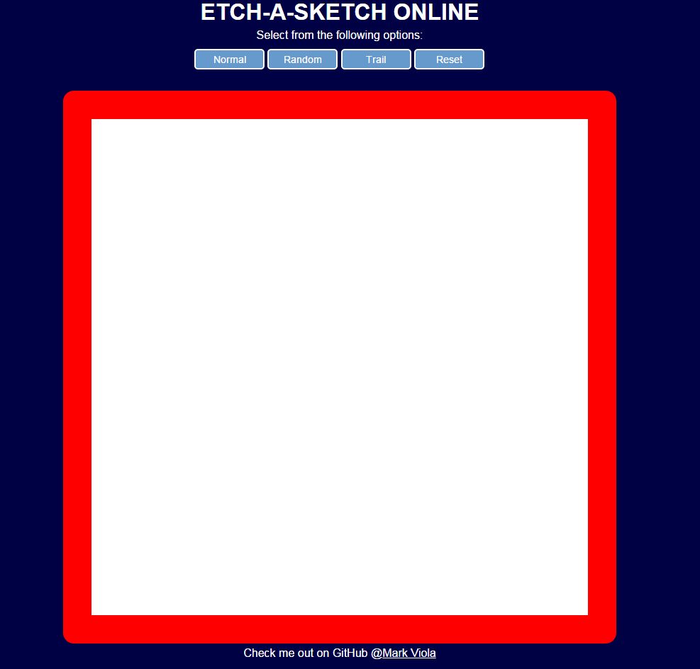

#Etch-a-Sketch Online

Etch-a-Sketch Online simulates the same expeience one would have using an Etch-a-Sketch. As the user moves the mouse cursor over the drawing space, the background color will change. Clicking on the various options allow the user to change the grid size of the drawing area.

Buttons:
* **Normal:** The changed color will be the default, black (#FFFFFF)
* **Random:** The changed color will be a random hex value from #000000 - #FFFFFF
* **Trail:** The color will change to black then gradually change back to the white background
* **Reset:** Reset the drawing space to its original state

#####Link
[Etch-a-Sketch Online](https://rawgit.com/markviola/the-odin-project/master/3-etch-a-sketch-online/index.html)