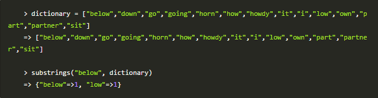
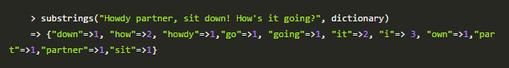

#3 - Substrings

Implement a mthod "substring" that takes a word as the first argument and then an array of valid substrings (your dictionary) as a second argument. It should return a hash listing each substring (case insensitive) that was found in the original string and how mant times it was found.

Make sure your method can handle multiple words.

