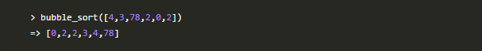
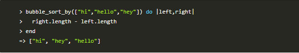

#More Ruby Problems 2

Ruby problems that focus on implementing blocks to solve. The objective is to get better practice in using Ruby to solve programming problems. Specifically, the bubble sort algorithm is to be recreated as well as a variety of Ruby functions such as `#each`, `#each_with_index`, `#select`, `#all?`, `#any?`, `#none?`, `#count`, `#map`, and `#inject`.

####1 - Bubble Sort
Implement `#bubble_sort` and `#bubble_sort_by` methods

* `#bubble_sort`: takes an array and returns a sorted array using the bubble sorting algorithm
* `#bubble_sort_by`: sorts an array but takes a block. The array is assumed to be an array of strings and the array will be sorted according to word length

######To run:
```
cd 7-more-ruby-problems/1 - Bubble Sort
```
```
ruby bubble_sort.rb
```

######Results:
`#bubble_sort` method



`#bubble_sort_by` method




####2 - Enumerable Methods
Rebuild a variety of methods native to Ruby including with the new names, `#my_each`, `#my_each_with_index`, `#my_select`, `#my_all?`, `#my_any?`, `#my_none?`, `#my_count`, `#my_map`, and `#my_inject`.

* `#my_each`: Calls the given block once for each element in self, passing that element as a parameter.
* `#my_each_with_index`: Calls block with two arguments, the item and its index, for each item in enum. 
* `#my_select`: Returns an array containing all elements of enum for which the given block returns a true value.
* `#my_all?`: Passes each element of the collection to the given block. The method returns true if the block never returns `false` or `nil`.
* `#my_any?`: Passes each element of the collection to the given block. The method returns true if the block ever returns a value other than `false` or `nil`.
* `#my_none?`: Passes each element of the collection to the given block. The method returns true if the block never returns `true` for all elements.
* `#my_count`: Returns the number of items in enum through enumeration. If an argumentis given, the number of items in the enum that are equal to item are counted. If a block is given, it counts the number of element yielding a true value.
* `#my_map`: Returns a new array with the results of running block once for every element in enum.
* `#my_inject`: Combines all elements of enum by applying binary operation, specified by a block or a symbol  that names a method or operator.

######To run:
```
cd 7-more-ruby-problems/2 - Enumerable Methods
```
```
ruby enumerable_methods.rb
```